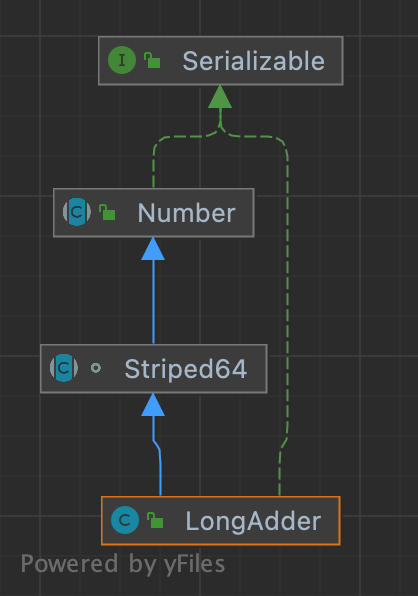

## 1 CAS 

### 1.1 概念

CAS(Compare And Swap，比较并交换)，通常指的是这样一种原子操作:针对一个变量，首 先比较它的内存值与某个期望值是否相同，如果相同，就给它赋一个新值。

CAS 的几步操作（比较、赋值）其实是一个不可分割的原子操作，并且其原子性是直接在硬件层面得到保障的。

CAS可以看做是乐观锁(对比数据库的悲观、乐观锁)的一种实现方式，Java原子类中的递增操 作就通过CAS自旋实现的。

CAS是一种无锁算法，在不使用锁(没有线程被阻塞)的情况下实现多线程之间的变量同步。


### 1.2 CAS 应用

以Unsafe 类下的 public final native boolean compareAndSwapInt(Object var1, long var2, int var4, int var5); 方法为例子，参数的含义分别是：对象实例、内存偏移量、字段期望值、字段新值。该方法会针对指定对象实例中的相应偏移 量的字段执行 CAS 操作

```java
public class CASTest {

    public static void main(String[] args) {
        Entity entity = new Entity();

        Unsafe unsafe = UnsafeFactory.getUnsafe();

        long offset = UnsafeFactory.getFieldOffset(unsafe, Entity.class, "x");
        System.out.println(offset);
        boolean successful;

        // 4个参数分别是：对象实例、字段的内存偏移量、字段期望值、字段更新值
        successful = unsafe.compareAndSwapInt(entity, offset, 0, 3);
        System.out.println(successful + "\t" + entity.x);

        successful = unsafe.compareAndSwapInt(entity, offset, 3, 5);
        System.out.println(successful + "\t" + entity.x);

        successful = unsafe.compareAndSwapInt(entity, offset, 3, 8);
        System.out.println(successful + "\t" + entity.x);

    }

}
class Entity{
    int x;
}

/*
true 3
true 5 
false 5
*/
```


### 1.3 CAS 缺点

* 配合自旋时，自旋长时间不成功，会给CPU带来非常大的开销
* 只能保证一个共享变量原子操作
* ABA 问题


#### 1.3.1 ABA 问题及解决方案

当有多个线程对一个原子类进行操作的时候，某个线程在短时间内将原子类的值A修改为B，又马上将其修改为A，此时其他线程不感知，还是会修改成功。


解决方案：

使用版本号来解决，经典数据库乐观锁方式。

java 提供了工具类 ： 

* AtomicStampedReference<V> 每次修改版本号加1
* AtomicMarkableReference<V> 修改过就记录


## 2 Atomic

JUC 包下提供的一些用来保证操作原子性的工具类，atomic包下的这些类都是采用的是乐观锁策略去原子更新数据，在java中则是使用CAS操作具体实现。

* **基本类型：**AtomicInteger、AtomicLong、AtomicBoolean；
* **引用类型：**AtomicReference、AtomicStampedRerence、AtomicMarkableReference；
* **数组类型：**AtomicIntegerArray、AtomicLongArray、AtomicReferenceArray
* **对象属性原子修改器**：AtomicIntegerFieldUpdater、AtomicLongFieldUpdater、AtomicReferenceFieldUpdater
* **原子类型累加器（jdk1.8增加的类）**：DoubleAccumulator、DoubleAdder、LongAccumulator、LongAdder、Striped64


自旋 + CAS 实现自增操作

```java
    public final int getAndAddInt(Object var1, long var2, int var4) {
        int var5;
        do {
            var5 = this.getIntVolatile(var1, var2);
        } while(!this.compareAndSwapInt(var1, var2, var5, var5 + var4));

        return var5;
    }
```


数组操作：AtomicIntegerArray

```java
//addAndGet(int i, int delta)：以原子更新的方式将数组中索引为i的元素与输入值相加；
public final int addAndGet(int i, int delta) {
    return getAndAdd(i, delta) + delta;
}
 
//getAndIncrement(int i)：以原子更新的方式将数组中索引为i的元素自增加1；
public final int getAndIncrement(int i) {
    return getAndAdd(i, 1);
}
 
//compareAndSet(int i, int expect, int update)：将数组中索引为i的位置的元素进行更新
public final boolean compareAndSet(int i, int expect, int update) {
    return compareAndSetRaw(checkedByteOffset(i), expect, update);
}
```


引用类型的使用： AtomicReference

```java
public class AtomicReferenceTest {

    public static void main( String[] args ) {
        User user1 = new User("张三", 23);
        User user2 = new User("李四", 25);
        User user3 = new User("王五", 20);

        //初始化为 user1
        AtomicReference<User> atomicReference = new AtomicReference<>();
        atomicReference.set(user1);

        //把 user2 赋给 atomicReference
        atomicReference.compareAndSet(user1, user2);
        System.out.println(atomicReference.get());

        //把 user3 赋给 atomicReference
        atomicReference.compareAndSet(user1, user3);
        System.out.println(atomicReference.get());   
    }
}
```


LongAddr / DoubleAddr 设计思想

在操作不复杂（i++这种）的并发中，使用自旋比较合理，但是并发量较高时会有大量的线程在自旋。

LongAddr 这类工具类使用了热点分散的思想来提高并发量。

```java
public class LongAdderTest {

    public static void main(String[] args) {
        testAtomicLongVSLongAdder(10, 10000);
        System.out.println("==================");
        testAtomicLongVSLongAdder(10, 200000);
        System.out.println("==================");
        testAtomicLongVSLongAdder(100, 200000);
    }

    static void testAtomicLongVSLongAdder(final int threadCount, final int times) {
        try {
            long start = System.currentTimeMillis();
            testLongAdder(threadCount, times);
            long end = System.currentTimeMillis() - start;
            System.out.println("条件>>>>>>线程数:" + threadCount + ", 单线程操作计数" + times);
            System.out.println("结果>>>>>>LongAdder方式增加计数" + (threadCount * times) + "次,共计耗时:" + end);

            long start2 = System.currentTimeMillis();
            testAtomicLong(threadCount, times);
            long end2 = System.currentTimeMillis() - start2;
            System.out.println("条件>>>>>>线程数:" + threadCount + ", 单线程操作计数" + times);
            System.out.println("结果>>>>>>AtomicLong方式增加计数" + (threadCount * times) + "次,共计耗时:" + end2);
        } catch (InterruptedException e) {
            e.printStackTrace();
        }
    }

    static void testAtomicLong(final int threadCount, final int times) throws InterruptedException {
        CountDownLatch countDownLatch = new CountDownLatch(threadCount);
        AtomicLong atomicLong = new AtomicLong();
        for (int i = 0; i < threadCount; i++) {
            new Thread(new Runnable() {
                @Override
                public void run() {
                    for (int j = 0; j < times; j++) {
                        atomicLong.incrementAndGet();
                    }
                    countDownLatch.countDown();
                }
            }, "my-thread" + i).start();
        }
        countDownLatch.await();
    }

    static void testLongAdder(final int threadCount, final int times) throws InterruptedException {
        CountDownLatch countDownLatch = new CountDownLatch(threadCount);
        LongAdder longAdder = new LongAdder();
        for (int i = 0; i < threadCount; i++) {
            new Thread(new Runnable() {
                @Override
                public void run() {
                    for (int j = 0; j < times; j++) {
                        longAdder.add(1);
                    }
                    countDownLatch.countDown();
                }
            }, "my-thread" + i).start();
        }

        countDownLatch.await();
    }
}
```


AtomicLong中有个内部变量value保存着实际的long值，所有的操作都是针对该变量进行。也就是说，高并发环境下，value变量其实是一个热点，也就是N个线程竞争一个热点。LongAdder的基本思路就是分散热点，将value值分散到一个数组中，不同线程会命中到数组的不同槽中，各个线程只对自己槽中的那个值进行CAS操作，这样热点就被分散了，冲突的概率就小很多。如果要获取真正的long值，只要将各个槽中的变量值累加返回。 

如图





add 操作流程图


```java
    public void add(long x) {
        Cell[] as; long b, v; int m; Cell a;
        if ((as = cells) != null || !casBase(b = base, b + x)) {
            boolean uncontended = true;
            if (as == null || (m = as.length - 1) < 0 ||
                (a = as[getProbe() & m]) == null ||
                !(uncontended = a.cas(v = a.value, v + x)))
                longAccumulate(x, null, uncontended);
        }
    }
```


sum 方法

放回调用当时的统计值，不能保证精确

```java
public long sum() {
    Cell[] as = cells; Cell a;
    long sum = base;
    if (as != null) {
        for (int i = 0; i < as.length; ++i) {
            if ((a = as[i]) != null)
                sum += a.value;
        }
    }
    return sum;
}
```

