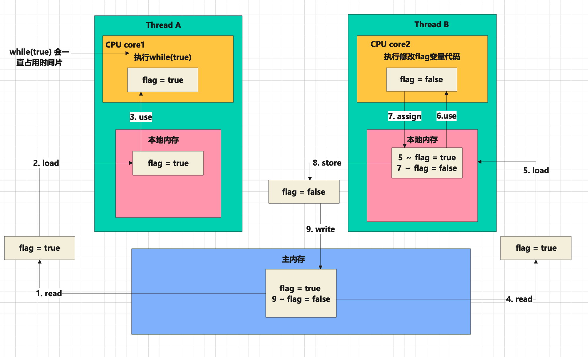
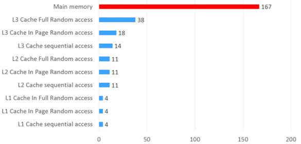
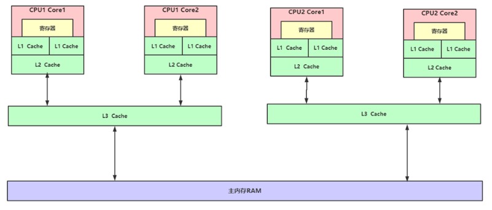
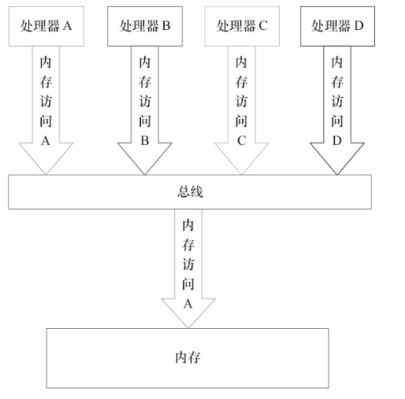
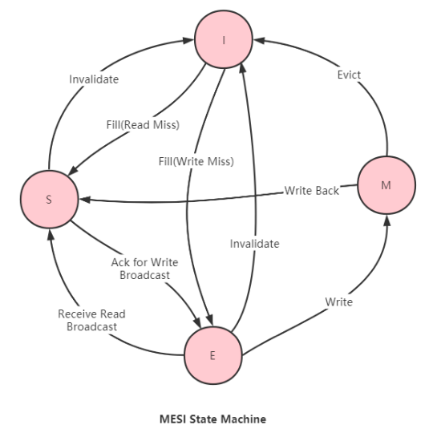
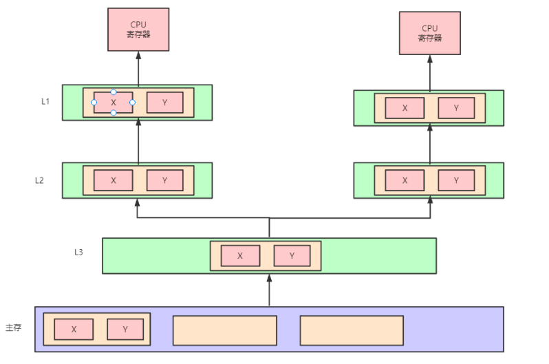

[toc]


#### 1 并行和并发

并行和并发目标都是最大化CPU的使用率

并行：指在同一时刻，有多条指令在多个处理器上同时执行


并发：指在同一时刻只能有一条指令执行，但多个进程指令被快速的轮换，使得宏观上具有多个进程同时执行的效果，但是在微观上并不是同时执行的，只是把时间分成若干段，使多个进程快速交替的执行。


**并行在多处理器系统中存在，而并发可以在单处理器和多处理器系统中都存在**，并发能够在单处理器系统中存在是因为并发是并行的假象，并行要求程序能够同时执行多个操作，而并发只是要求程序假装同时执行多个操作(每个小时间片执行一个操作，多个操作快速切换执行)


#### 2 并发三大特性

* 可见性：当一个线程修改了共享变量的值，其他线程能够看到修改的值
  * 通过 volatile 关键字保证可见性。
  *  通过 内存屏障保证可见性。
  *  通过 synchronized 关键字保证可见性。 通过 Lock保证可见性。
  *  通过 final 关键字保证可见性
* 有序性：即程序执行的顺序按照代码的先后顺序执行。JVM 存在指令重排，所以存在有序性问题。
  * 通过  volatile 关键字保证可见性。
  * 通过  内存屏障保证可见性。
  * 通过  synchronized关键字保证有序性。
  * 通过  Lock保证有序性。
* 原子性：**一个或多个操作要么全部执行且在执行过程中不被任何因素打断，要么全部不执行。**在Java 中，对基本数据类型的变量的读取和赋值操作是原子性操作(64位处理器)。不采取任 何的原子性保障措施的自增操作并不是原子性的。
  * 通过 synchronized 关键字保证原子性。
  * 通过 Lock保证原子性。
  * 通过 CAS保证原子性


```java
public class VisibilityTest {
    private boolean flag = true;
    private Integer count = 0;

    public void refresh() {
        flag = false;
        System.out.println(Thread.currentThread().getName() + "修改flag:"+flag);
    }

    public void load() {
        System.out.println(Thread.currentThread().getName() + "开始执行.....");
        while (flag) {
            // 加volatile 保证线程间的可见性
            // private volatile boolean flag = true;

            // 显示使用内存屏障 可保障可见性
//            UnsafeFactory.getUnsafe().storeFence();

            // 释放时间片 - 线程切换 保存上下文 得到时间片后还原现场到主存比对 & 重新加载变量
//            Thread.yield();

            // 能够跳出循环，方法内部使用 synchronized 底层也是内存屏障
//            System.out.println(count);

            // 内存屏障
//            LockSupport.unpark(Thread.currentThread());

            // count 加 volatile 保证线程间的可见性

            // 将count 修改 Integer 保证线程可见性

            // 等待一段时间、如果时间足够本地内存将过期，会从主从中加载新的值也会跳出循环
//            shortWait(1000000);

            count++;
        }
        System.out.println(Thread.currentThread().getName() + "跳出循环: count=" + count);
    }

    public void count1() {
        for (int i = 0; i < 10000; i++) {
            count++;
        }
    }

    public static void main(String[] args) throws InterruptedException {
        VisibilityTest test = new VisibilityTest();

        // 线程threadA模拟数据加载场景
        Thread threadA = new Thread(test::load, "threadA");
        threadA.start();

        // 让threadA执行一会儿
        Thread.sleep(1000);
        // 线程threadB通过flag控制threadA的执行时间
        Thread threadB = new Thread(test::refresh, "threadB");
        threadB.start();
    }

    public static void shortWait(long interval) {
        long start = System.nanoTime();
        long end;
        do {
            end = System.nanoTime();
        } while (start + interval >= end);
    }
}
```


#### 3 Java 内存模型 JMM 

Java虚拟机规范中定义了Java内存模型(Java Memory Model，JMM)，用于屏蔽掉各种硬件和操作系统的内存访问差异，以实现让Java程序在各种平台下都能达到一致的并发效 果，JMM规范了Java虚拟机与计算机内存是如何协同工作的:**规定了一个线程如何和何时可以看到由其他线程修改过后的共享变量的值，以及在必须时如何同步的访问共享变量。** JMM 是抽象的概念，并不是实际存在的内存空间。通过自定义的规则控制各个变量在共享数据区域和私有数据区域的访问方式，JMM 是围绕原子性、有序性、可见性开展的。


通过JMM 模型分析上面的例子：




内存交互操作：

关于主内存与工作内存之间的具体交互协议，即一个变量如何从主内存拷贝到工作内存、如何从工作内存同步到主内存之间的实现细节，Java内存模型定义了以下八种操作来完成：

* lock(锁定):作用于主内存的变量，把一个变量标识为一条线程独占状态。
* unlock(解锁):作用于主内存变量，把一个处于锁定状态的变量释放出来，释放后的变量才可以被其他线程锁定。 
* read(读取):作用于主内存变量，把一个变量值从主内存传输到线程的工作内存中，以便随后的load动作使用 
* load(载入):作用于工作内存的变量，它把read操作从主内存中得到的变量值放入工作内存的变量副本中
* use(使用):作用于工作内存的变量，把工作内存中的一个变量值传递给执行引 擎，每当虚拟机遇到一个需要使用变量的值的字节码指令时将会执行这个操作。
* assign(赋值):作用于工作内存的变量，它把一个从执行引擎接收到的值赋值给 工作内存的变量，每当虚拟机遇到一个给变量赋值的字节码指令时执行这个操作。
* store(存储):作用于工作内存的变量，把工作内存中的一个变量的值传送到主 内存中，以便随后的write的操作。
* write(写入):作用于主内存的变量，它把store操作从工作内存中一个变量的值 传送到主内存的变量中。


#### 4 volatile

* 可见性： 对一个volatile变量的读，总是能看到(任意线程)对这个volatile变量最后的写入。
  * 当写一个volatile变量时，JMM会把该线程对应的本地内存的共享变量值刷新到主内存。
  * 当读一个volatile变量时，JMM会把该线程对应的本地内存置为无效，线程接下来将从主内存中读取共享变量。
* 有序性：对volatile修饰的变量的读写操作前后加上各种特定的内存屏障来禁止指令重排序来保障有序性。


##### 4.1 volatile 是如何保证内存可见性的？

1. volatile 修改的变量的read\load\use操作和assign\store\write操作必须是连续的，即修改后必须立即同步回主内存，使用时必须从主内存刷新，由此保证volatile变量操作对多线程的可见性。
2. 硬件层面通过lock 前缀指令，会锁定变量缓存行区域写回主内存，这个操作被称为“缓存锁定”。缓存一致性机制会阻止两个不同处理器本地内存同步至主内存。一个处理器的缓存回写到主内存会导致其他处理器的缓存无效。
3. ~~在JVM 中的操作流程大致是：判断缓存的变量是否加了volatile，加了volatile 就添加storeload 内存屏障，这里会判断操作系统是否是多核的，如果是多核那么就将在汇编指令中增加lock 前缀指令来实现内存屏障的功能。~~


##### 4.2 lock 前缀指令的作用：

1. 确保后续指令执行的原子性。在较老的处理器中，带有lock前缀的指令在执 行期间会锁住总线，使得其它处理器暂时无法通过总线访问内存，很显然，这个开销很 大。在新的处理器中，Intel使用缓存锁定来保证指令执行的原子性，缓存锁定将大大降低 lock前缀指令的执行开销。
2. LOCK前缀指令具有类似于内存屏障的功能，禁止该指令与前面和后面的读写指令重排序。
3. LOCK前缀指令会**等待它之前所有的指令完成、并且所有缓冲的写操作写回内存(也就是将store buffer中的内容写入内存)之后才开始执行**，并且根据缓存一致性协议，刷新 store buffer的操作会导致其他cache中的副本失效。


#### 5 CPU 高速缓存

CPU缓存即高速缓冲存储器，是位于CPU与主内存间的一种容量较小但速度很高的存储 器。由于CPU的速度远高于主内存，CPU直接从内存中存取数据要等待一定时间周期，Cache中 保存着CPU刚用过或循环使用的一部分数据，当CPU再次使用该部分数据时可从Cache中直接调 用,减少CPU的等待时间，提高了系统的效率。







从上面两张图片可以看出，约靠近CPU的缓存区域读写速度越快。


局部性原理：CPU在访问存储设备时（存取数据或存取指令）都趋向于存取一片连续的区域。

* 时间局部性： 如果一个信息项正在被访问，那么在近期它很可能还会被再次访问。比如循环、递归、方法反复调用。
* 空间局部性：如果存储器的位置被引用，那么将来他附近的位置也会被引用。比如顺序执行的代码、连续创建的两个对象、数组等。


多CPU 多核缓存架构：如上图。现代CPU为了提升执行效率，减少CPU与内存（较远的）的交互，一般在CPU上集成了多级缓存架 构，常见的为三级缓存结构。


#### 6 缓存一致性


缓存一致性是为了保证共享资源数据的一致性。由于多级缓存架构，这些数据会存储在多个本地缓存中。当系统维护公共内存资源的缓存时，可能会出现数据不一致的问题。

如下两个线程读取并修改了同一个数据，如果没有缓存一致性的考虑，那么它们就都将修改后的值放回主内存，这样就会出现一个修改覆盖另一个修改的问题。


在共享内存多处理器系统中，每个处理器都有一个单独的缓存内存，共享数据可能有多个副 本:一个副本在主内存中，一个副本在请求它的每个处理器的本地缓存中。当数据的一个副本发 生更改时，其他副本必须反映该更改。缓存一致性是确保共享操作数(数据)值的变化能够及时地 在整个系统中传播的规程。如下：


##### 6.1 缓存一致性的要求

* 写传播：对任何缓存中的数据的更改都必须传播到对等缓存中的其他副本(该缓存行的副本)。
* 事务串行化：对单个内存位置的读/写必须被所有处理器以相同的顺序看到。
* 一致性机制：确保一致性的两种最常见的机制是窥探机制和基于目录的机制。


##### 6.2 总线仲裁机制

###### 6.2.1总线事务

在计算机中，数据通过总线在处理器和内存之间传递。每次处理器和内存之间的数据传递都是通过一系列步骤来完成的，这一系列步骤之为总线事务。总线事务包 括读事务(Read Transaction)和写事务(WriteTransaction)。读事务从内存传送数据到处 理器，写事务从处理器传送数据到内存，每个事务会读/写内存中一个或多个物理上连续的字。 这里的关键是，总线会同步试图并发使用总线的事务。在一个处理器执行总线事务期间，总线会 禁止其他的处理器和I/O设备执行内存的读/写。




###### 6.2.2 总线仲裁

多个处理器同时向总线发起总线事务，这时总线会进行选择，这种行为叫做总线仲裁。

总线的这种工作机制可以把所有处理器对内存的访问以串行化的方式来执行。在任意时间 点，最多只能有一个处理器可以访问内存。这个特性确保了单个总线事务之中的内存读/写操作具有原子性。

处理器会自动保证基本的内存操作的原子 性，也就是一个处理器从内存中读取或者写入一个字节时，其他处理器是不能访问这个字节的内 存地址。

复杂的内存操作处理器是不能自动保证其原子性的，比如跨总线宽度、跨多个缓存行和 跨页表的访问。处理器提供总线锁定和缓存锁定两个机制来保证复杂内存操作的原子性。


* 总线锁定：总线锁定就是使用处理器提供的一个 LOCK#信号，当其中一个处理器在总线上输出此信号时，其它处理器的请求将被阻塞住，那么该处理器可以独占共享内存。
  * 由于总线锁定阻止了被阻塞处理器和所有内存之间的通信，而输出LOCK#信号的CPU可能 只需要锁住特定的一块内存区域，因此总线锁定开销较大。
* 缓存锁定：缓存一致性机制来保证操作的原子性，因为缓存一致性机制 会阻止同时修改由两个以上处理器缓存的内存区域数据，当其他处理器回写已被锁定的缓存行的 数据时，会使缓存行无效。


##### 6.3 总线窥探

总线窥探是缓存中的一致性控制器监视或窥探总线事务的一种方案，其目标是在分布式共享内存系统中维护缓存一致性。

**当特定数据被多个缓存共享时，处理器修改了共享数据的值，更改必须传播到所有其他具有 该数据副本的缓存中。这种更改传播可以防止系统违反缓存一致性。**


窥探协议的类型：

* Write-invalidate : 当处理器写入一个共享缓存块时，其他缓存中的所有共享副本都会通过总线窥探失效
* Write-update:当处理器写入一个共享缓存块时，其他缓存的所有共享副本都会通过总线窥探更新


##### 6.4 一致性协议 MESI

一致性协议在多处理器系统中应用于高速缓存一致性。

MESI协议是一个基于写失效(Write-invalidate)的缓存一致性协议.

它对应的缓存行状态：

* M ： 已修改。缓存行是脏的，与主存的值不同。如果别的CPU内核要读主存这块数据，该缓存行必须回写到主存，状态变为共享(S).
* E ：独占。缓存行只在当前缓存中，但是干净的--缓存数据同于主存数据。当别的缓存读取它时，状态变为共享; 当前写数据时，变为已修改状态。
* S： 共享。缓存行也存在于其它缓存中且是未修改的。缓存行可以在任意时刻抛弃。
* I ：缓存行是无效的


不同处理器中缓存行的相容关系：


缓存行状态变更：




##### 6.5 伪共享问题

如果多个核的线程在操作同一个缓存行中的不同变量数据，那么就会出现频繁的缓存失效，即使 在代码层面看这两个线程操作的数据之间完全没有关系。这种不合理的资源竞争情况就是伪共享。




使用下面两种避免伪共享的方式这段代码的效率将会大大提高。

```java
public class FalseSharingTest {

    public static void main(String[] args) throws InterruptedException {
        testPointer(new Pointer());
    }

    private static void testPointer(Pointer pointer) throws InterruptedException {
        long start = System.currentTimeMillis();
        Thread t1 = new Thread(() -> {
            for (int i = 0; i < 100000000; i++) {
                pointer.x++;
            }
        });

        Thread t2 = new Thread(() -> {
            for (int i = 0; i < 100000000; i++) {
                pointer.y++;
            }
        });

        t1.start();
        t2.start();
        t1.join();
        t2.join();

        System.out.println(pointer.x+","+pointer.y);

        System.out.println(System.currentTimeMillis() - start);
    }
}


class Pointer {
    // 避免伪共享： @Contended +  jvm参数：-XX:-RestrictContended  jdk8支持
    //@Contended
    volatile long x;
    //避免伪共享： 缓存行填充使这个对象大于CPU默认的缓存大小（64B）
    //long p1, p2, p3, p4, p5, p6, p7; // 8 * 7 = 56 ，56 + 8 = 64
    volatile long y;
}
```


