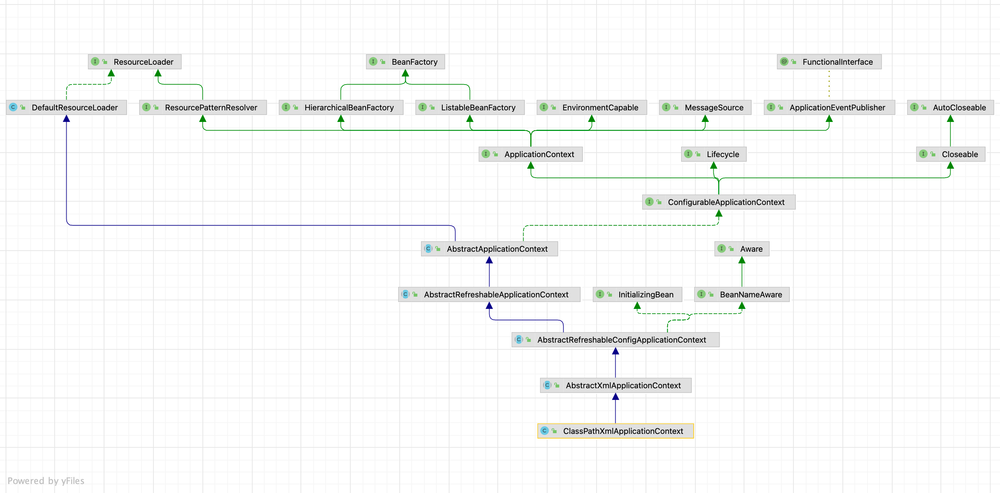

[toc]


### 源码中常见的类使用


#### 1 BeanDeinition

BeanDefinition表示Bean定义，BeanDefinition中存在很多属性用来描述一个Bean的特点。

* class ：表示bean类型
* scope：表示bean 作用域，singleton or prototype
* lazyInit：表示bean是否是懒加载
* initMethodName：表示bean初始化时要执行的方法
* destroyMethodName：表示bean销毁时要执行的方法
* ...


定义bean的几种方式：

1. <bean />
2. @Bean
3. @Component(@Service \ @Controller)
4. 上面属于声明式定义bean，也可以编程式定义bean。
   使用BeanDefinition 构造一个bean，如下

```java
AnnotationConfigApplicationContext context = new AnnotationConfigApplicationContext(AppConfig.class);
// 构建一个beanDefinition
AbstractBeanDefinition beanDefinition = BeanDefinitionBuilder.genericBeanDefinition().getBeanDefinition();
// 设置beanDefinition 的一些信息
beanDefinition.setBeanClass(User.class);
beanDefinition.setScope("prototype");
beanDefinition.setInitMethodName("init");
beanDefinition.setLazyInit(true);
// 将beanDefinition 注册到ioc 容器中
context.registerBeanDefinition("user", beanDefinition);
// 从容器中取出bean
System.out.println(context.getBean("user"));
```


#### 2 BeanDefinitionReader

BeanDefinition 读取器，可以直接把某个类转换为BeanDefinition，并且会解析该类上的注解将属性放入BeanDefinition


AnnotatedBeanDefinitionReader

```java
AnnotationConfigApplicationContext context = new AnnotationConfigApplicationContext(AppConfig.class);
// 创建一个BeanDefinition 读取器
AnnotatedBeanDefinitionReader annotatedBeanDefinitionReader = new AnnotatedBeanDefinitionReader(context);
// 将一个类注册成BeanDefinition
annotatedBeanDefinitionReader.register(User.class);
// 获取bean 
System.out.println(context.getBean("user"));
```


XmlBeanDefinitionReader

```java
AnnotationConfigApplicationContext context = new AnnotationConfigApplicationContext(AppConfig.class);
// 创建一个BeanDefinition 读取器
XmlBeanDefinitionReader xmlBeanDefinitionReader = new XmlBeanDefinitionReader(context);
// 从Spring.xml 中读取配置好的bean <bean>，i 表示读取了多少个bean
int i = xmlBeanDefinitionReader.loadBeanDefinitions("spring.xml");
// 获取bean
System.out.println(context.getBean("user"));
```


ClassPathBeanDefinitionScanner

ClassPathBeanDefinitionScanner是扫描器，但是它的作用和BeanDefinitionReader类似，它可以 进行扫描，扫描某个包路径，对扫描到的类进行解析，比如，扫描到的类上如果存在@Component 注解，那么就会把这个类解析为一个BeanDefinition

```java
AnnotationConfigApplicationContext context = new AnnotationConfigApplicationContext();
context.refresh();
// 创建一个扫描器
ClassPathBeanDefinitionScanner scanner = new ClassPathBeanDefinitionScanner(context);
// 指定要扫描的路径 进行扫描
scanner.scan("com.zhouyu");
// 获取bean
System.out.println(context.getBean("userService"));
```


#### 3 BeanFactory

BeanFactory表示Bean工厂，所以很明显，BeanFactory会负责创建Bean，并且提供获取Bean的 API。


##### 3.1 ApplicationContext

AnnotationConfigApplicationContext 父类 ApplicationContext 示意图，可见 IOC 容器除了具有beanfactory的功能外还有其他功能

ApplicationContext 各个父类作用

1. HierarchicalBeanFactory:拥有获取父BeanFactory的功能
2. ListableBeanFactory:拥有获取beanNames的功能
3. ResourcePatternResolver:资源加载器，可以一次性获取多个资源(文件资源等等) 
4. EnvironmentCapable:可以获取运行时环境(没有设置运行时环境功能)
5. ApplicationEventPublisher:拥有广播事件的功能(没有添加事件监听器的功能)
6. MessageSource:拥有国际化功能


###### 3.1.1 实现类AnnotationConfigApplicationContext 类示意图

org.springframework.context.support.GenericApplicationContext#beanFactory 的默认工厂是`DefaultListableBeanFactory`


###### 3.1.1 实现类 ClassPathXmlApplicationContext 示意图




###### 3.1.3 国际化使用

```java
@Bean
public MessageSource messageSource() {
    ResourceBundleMessageSource messageSource = new ResourceBundleMessageSource();
    messageSource.setBasename("messages");
    return messageSource
}


context.getMessage("test", null, new Locale("en_CN"))
```


###### 3.1.4  资源加载

```java
AnnotationConfigApplicationContext context = new AnnotationConfigApplicationContext(AppConfig.class);
Resource resource = context.getResource("/xx/xx.java");
System.out.println(resource.contentLength());
System.out.println(resource.getFilename());

Resource resource1 = context.getResource("https://www.baidu.com");
System.out.println(resource1.contentLength());
System.out.println(resource1.getURL());

Resource resource2 = context.getResource("classpath:spring.xml");
System.out.println(resource2.contentLength());
System.out.println(resource2.getURL());

Resource[] resources = context.getResources("classpath:com/zhouyu/*.class");
for (Resource resource : resources) {
  System.out.println(resource.contentLength());
  System.out.println(resource.getFilename());
}
```


###### 3.1.5 获取环境变量

```java
AnnotationConfigApplicationContext context = new AnnotationConfigApplicationContext(AppConfig.class);
Map<String, Object> systemEnvironment = context.getEnvironment().getSystemEnvironment();
System.out.println(systemEnvironment);
System.out.println("=======");

Map<String, Object> systemProperties = context.getEnvironment().getSystemProperties();
System.out.println(systemProperties);
System.out.println("=======");

// 配合 @PropertySource("classpath:spring.properties") 注解来使用
MutablePropertySources propertySources = context.getEnvironment().getPropertySources();
System.out.println(propertySources);
System.out.println("=======");

System.out.println(context.getEnvironment().getProperty("NO_PROXY"));
System.out.println(context.getEnvironment().getProperty("sun.jnu.encoding"));
System.out.println(context.getEnvironment().getProperty("zhouyu"));
```


###### 3.1.6 事件发布


```java
// 定义一个事件监听器
	@Bean
	public ApplicationListener applicationListener() {
		return new ApplicationListener() {
			@Override
			public void onApplicationEvent(ApplicationEvent event) {
				System.out.println("接收到了一个事件");
			}
		};
	}
// 发布事件
  context.publishEvent("kkk");
```


##### 3.2 DefaultListableBeanFactory

DefaultListableBeanFactory 可以将它看作一种IOC 容器, 下面没什么用看看就行了

1. AliasRegistry:支持别名功能，一个名字可以对应多个别名
2. BeanDefinitionRegistry:可以注册、保存、移除、获取某个BeanDefinition
3. BeanFactory:Bean工厂，可以根据某个bean的名字、或类型、或别名获取某个Bean对象
4. SingletonBeanRegistry:可以直接注册、获取某个单例Bean
5. SimpleAliasRegistry:它是一个类，实现了AliasRegistry接口中所定义的功能，支持别名功能
6. ListableBeanFactory:在BeanFactory的基础上，增加了其他功能，可以获取所有 BeanDefinition的beanNames，可以根据某个类型获取对应的beanNames，可以根据某个类 型获取{类型:对应的Bean}的映射关系
7. HierarchicalBeanFactory:在BeanFactory的基础上，添加了获取父BeanFactory的功能
8. DefaultSingletonBeanRegistry:它是一个类，实现了SingletonBeanRegistry接口，拥有了直 接注册、获取某个单例Bean的功能
9. ConfigurableBeanFactory:在HierarchicalBeanFactory和SingletonBeanRegistry的基础上， 添加了设置父BeanFactory、类加载器(表示可以指定某个类加载器进行类的加载)、设置 Spring EL表达式解析器(表示该BeanFactory可以解析EL表达式)、设置类型转化服务(表示 该BeanFactory可以进行类型转化)、可以添加BeanPostProcessor(表示该BeanFactory支持 Bean的后置处理器)，可以合并BeanDefinition，可以销毁某个Bean等等功能
10. FactoryBeanRegistrySupport:支持了FactoryBean的功能
11. AutowireCapableBeanFactory:是直接继承了BeanFactory，在BeanFactory的基础上，支持 在创建Bean的过程中能对Bean进行自动装配
12. AbstractBeanFactory:实现了ConfigurableBeanFactory接口，继承了 FactoryBeanRegistrySupport，这个BeanFactory的功能已经很全面了，但是不能自动装配和 获取beanNames
13. ConfigurableListableBeanFactory:继承了ListableBeanFactory、 AutowireCapableBeanFactory、ConfigurableBeanFactory
14. AbstractAutowireCapableBeanFactory:继承了AbstractBeanFactory，实现了 AutowireCapableBeanFactory，拥有了自动装配的功能
15. DefaultListableBeanFactory:继承了AbstractAutowireCapableBeanFactory，实现了 ConfigurableListableBeanFactory接口和BeanDefinitionRegistry接口，所以 DefaultListableBeanFactory的功能很强大


``` java
// 创建beanfactory
DefaultListableBeanFactory beanFactory = new DefaultListableBeanFactory();
// 构建一个beanDefinition
AbstractBeanDefinition beanDefinition = BeanDefinitionBuilder.genericBeanDefinition().getBeanDefinition();
beanDefinition.setBeanClass(User.class);
// 使用 beanfactory 注册 beanDefinition
beanFactory.registerBeanDefinition("user", beanDefinition);
// 获取bean
System.out.println(beanFactory.getBean("user"));
```


#### 4 类型转换

##### 4.1 PropertyEditor

JDK中提供的类型转化工具类

基本使用

```java
public class StringToUserPropertyEditor extends PropertyEditorSupport implements PropertyEditor {
	@Override
	public void setAsText(String text) throws IllegalArgumentException {
		User user = new User();
		user.setName(text);
		this.setValue(user);
	}
}
```

```java
StringToUserPropertyEditor propertyEditor = new StringToUserPropertyEditor();
propertyEditor.setAsText("1");
User value = (User) propertyEditor.getValue();
System.out.println(value);
```


spring 中的使用

```java
// 如何向Spring中注册PropertyEditor
@Bean
public CustomEditorConfigurer customEditorConfigurer() {
  CustomEditorConfigurer customEditorConfigurer = new CustomEditorConfigurer();
  Map<Class<?>, Class<? extends PropertyEditor>> propertyEditorMap = new HashMap<>();
  propertyEditorMap.put(User.class, StringToUserPropertyEditor.class);
  customEditorConfigurer.setCustomEditors(propertyEditorMap);
  return customEditorConfigurer;
}

// 通过向上面这个bean中添加转换器如下 类型转换在Spring便可实现
@Component
public class UserService {
  @Value("xxx")
  private User user;
  public void test() {
    System.out.println(user);
  }
}
```


##### 4.2 ConversionService

Spring中提供的类型转化服务，它比PropertyEditor更强大

基本使用

```java
public class StringToUserConverter implements ConditionalGenericConverter {
  // 类型是否可以转换
	@Override
	public boolean matches(TypeDescriptor sourceType, TypeDescriptor targetType) {
		return sourceType.getType().equals(String.class) && targetType.getType().equals(User.class);
	}

  // 获取该转换器的 sourceType、targetType 对
	@Override
	public Set<ConvertiblePair> getConvertibleTypes() {
		return Collections.singleton(new ConvertiblePair(String.class, User.class));
	}

  // 进行转换的具体逻辑
	@Override
	public Object convert(Object source, TypeDescriptor sourceType, TypeDescriptor targetType) {
		User user = new User();
		user.setName((String) source);
		return user;
	}
}
```


```java
DefaultConversionService conversionService = new DefaultConversionService();
conversionService.addConverter(new StringToUserConverter());
User value = conversionService.convert("1", User.class);
System.out.println(value);
```


spring 中的使用

```java
@Bean
public ConversionServiceFactoryBean conversionService() {
  ConversionServiceFactoryBean conversionServiceFactoryBean = new ConversionServiceFactoryBean();
  conversionServiceFactoryBean.setConverters(Collections.singleton(new StringToUserConverter()));
  return conversionServiceFactoryBean;
}
```


##### 4.3 TypeConverter

整合了PropertyEditor和ConversionService的功能，是Spring内部用的

```java
SimpleTypeConverter typeConverter = new SimpleTypeConverter();
typeConverter.registerCustomEditor(User.class, new StringToUserPropertyEditor());
//typeConverter.setConversionService(conversionService);
User value = typeConverter.convertIfNecessary("1", User.class);
System.out.println(value);
```


#### 5 排序相关

```java
public class A implements Ordered {
	@Override
	public int getOrder() {
		return 3;
	}

	@Override
	public String toString() {
		return this.getClass().getSimpleName();
	}
}
```


```java
public class B implements Ordered {
	@Override
	public int getOrder() {
		return 2;
	}

	@Override
	public String toString() {
		return this.getClass().getSimpleName();
	}
}
```


```java
public class Main {
	public static void main(String[] args) {
		A a = new A(); // order=3
		B b = new B(); // order=2
		OrderComparator comparator = new OrderComparator();
		System.out.println(comparator.compare(a, b));  // 1
		List list = new ArrayList<>();
		list.add(a);
		list.add(b);
		// order
		list.sort(comparator);
		System.out.println(list); // B A 
	}
}
```


OrderComparator 子类 AnnotationAwareOrderComparator 支持 @Order 注解功能，值小的排在前面


#### 6 BeanPostProcessor

BeanPostProcess表示Bena的后置处理器，我们可以定义一个或多个BeanPostProcessor。

一个BeanPostProcessor可以在任意一个Bean的初始化之前以及初始化之后去额外的做一些用户自 定义的逻辑。

我们可以通过定义BeanPostProcessor来干涉Spring创建Bean的过程。


```java
@Component
public class ZhouyuBeanPostProcessor implements BeanPostProcessor {
	@Override
	public Object postProcessBeforeInitialization(Object bean, String beanName) throws BeansException {
		if ("userService".equals(beanName)) {
			System.out.println("初始化前");
		}
		return bean;
	}

	@Override
	public Object postProcessAfterInitialization(Object bean, String beanName) throws BeansException {
		if ("userService".equals(beanName)) {
			System.out.println("初始化后");
		}
		return bean;
	}
}
```


#### 7 BeanFactoryPostProcessor

BeanFactoryPostProcessor表示Bean工厂的后置处理器，其实和BeanPostProcessor类似， BeanPostProcessor是干涉Bean的创建过程，BeanFactoryPostProcessor是干涉BeanFactory的创 建过程。

```java
@Component
public class ZhouyuBeanFactoryPostProcessor implements BeanFactoryPostProcessor {
	@Override
	public void postProcessBeanFactory(ConfigurableListableBeanFactory beanFactory) throws BeansException {
		System.out.println("加工beanFactory");
	}
}
```


#### 8 FactoryBean

通过这种方式 创造出来的UserService的Bean，只会经过初始化后，其他Spring的生命周期步骤是不会经过的，比 如依赖注入。

通过@Bean也可以自己生成一个对象作为Bean，那么和FactoryBean的区别是 什么呢?其实在很多场景下他俩是可以替换的，但是站在原理层面来说的，区别很明显，@Bean定 义的Bean是会经过完整的Bean生命周期的。

```java
@Component
public class ZhouyuFactoryBean implements FactoryBean {
	@Override
	public Object getObject() throws Exception {
		UserService userService = new UserService();
		return userService;
	}

	@Override
	public Class<?> getObjectType() {
		return UserService.class;
	}
}
```


#### 9 ExcludeFilter和IncludeFilter

这两个Filter是Spring扫描过程中用来过滤的。ExcludeFilter表示排除过滤器，IncludeFilter表示包 含过滤器。


比如以下配置，表示扫描com.zhouyu这个包下面的所有类，但是排除UserService类，也就是就算 它上面有@Component注解也不会成为Bean。

```java
@ComponentScan(value = "com.zhouyu",
		excludeFilters = {@ComponentScan.Filter(
				type = FilterType.ASSIGNABLE_TYPE,
				classes = UserService.class)})
public class AppConfig {
}
```


再比如以下配置，就算UserService类上没有@Component注解，它也会被扫描成为一个Bean。

```java
@ComponentScan(value = "com.zhouyu",
		includeFilters = {@ComponentScan.Filter(
				type = FilterType.ASSIGNABLE_TYPE,
				classes = UserService.class)})
public class AppConfig {
}
```


FilterType分为:

1. ANNOTATION:表示是否包含某个注解
2. ASSIGNABLE_TYPE:表示是否是某个类
3.  ASPECTJ:表示否是符合某个Aspectj表达式 4. REGEX:表示是否符合某个正则表达式
4. CUSTOM:自定义


#### 10 MetadataReader、ClassMetadata、 AnnotationMetadata


##### 10.1 MetadataReader

MetadataReader表示类的元数据读取器，默认实现类为SimpleMetadataReader.

```java
		SimpleMetadataReaderFactory simpleMetadataReaderFactory = new SimpleMetadataReaderFactory();
		// MetadataReader
		MetadataReader metadataReader = simpleMetadataReaderFactory.getMetadataReader("com.zhouyu.service.UserService");
		// ClassMetadata
		ClassMetadata classMetadata = metadataReader.getClassMetadata();
		System.out.println(classMetadata.getClassName());
		// AnnotationMetadata
		AnnotationMetadata annotationMetadata = metadataReader.getAnnotationMetadata();
		for (String annotationType : annotationMetadata.getAnnotationTypes()) {
			System.out.println(annotationType);
		}
```


