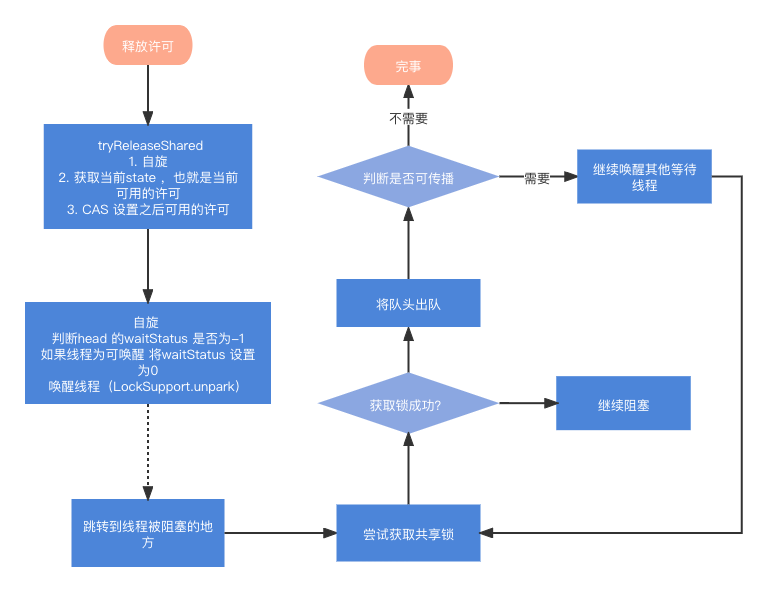
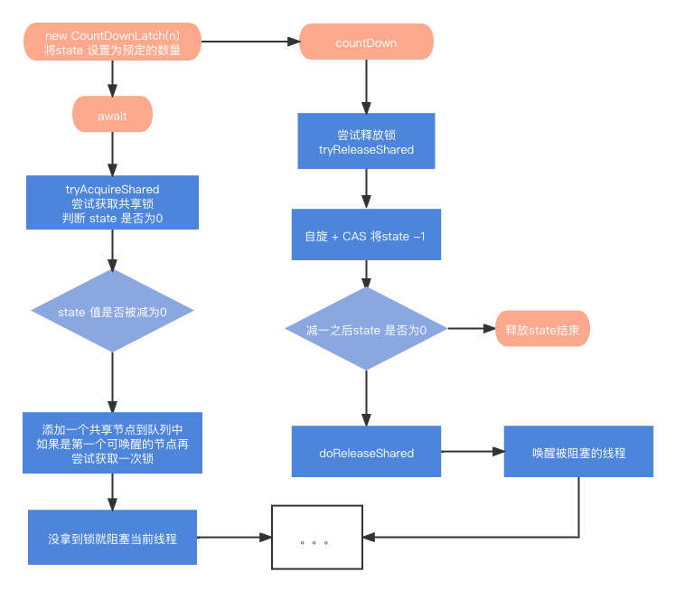
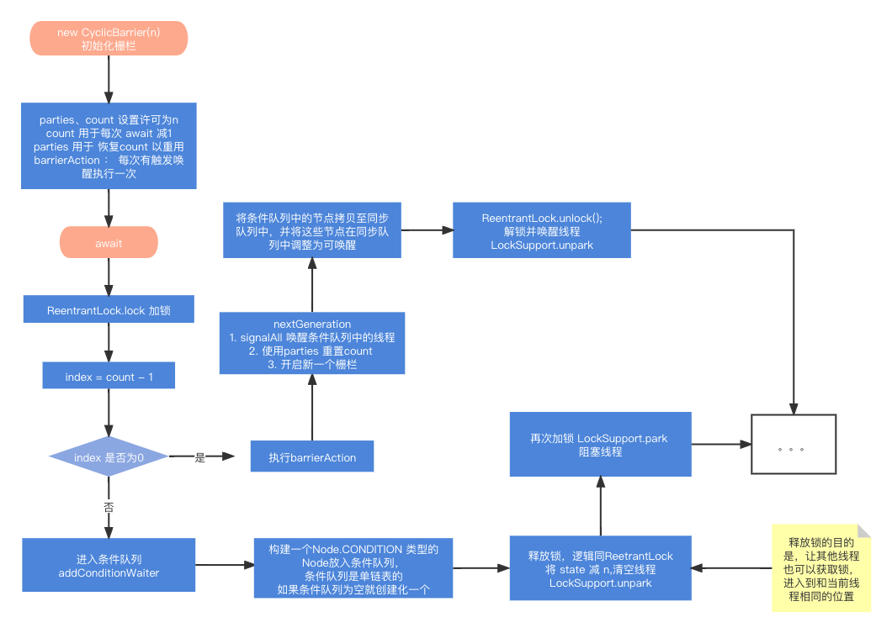

## 1. Semaphore 

### 1.1 概念

Semaphore，信号量，大小为1的信号量就类似于互斥锁，通过同时只能有一个线程获取信号量实现。大小为n（n>0）的信号量可以实现限流的功能，它可以实现只能有n个线程同时获取信号量。


构造器参数：

- permits 表示许可证的数量（资源数）
- fair 表示公平性，如果这个设为 true 的话，下次执行的线程会是等待最久的线程


常用方法：

* acquire() 表示阻塞并获取许可
* tryAcquire() 方法在没有许可的情况下会立即返回 false，要获取许可的线程不会阻塞
* release() 表示释放许可
* int availablePermits()：返回此信号量中当前可用的许可证数。
* int getQueueLength()：返回正在等待获取许可证的线程数。
* boolean hasQueuedThreads()：是否有线程正在等待获取许可证。
* void reducePermit（int reduction）：减少 reduction 个许可证
* Collection getQueuedThreads()：返回所有等待获取许可证的线程集合


### 1.2 使用

模拟买票的窗口工作

```java
public class SemaphoreTest {

    public static void main(String[] args) {
        // 声明3个窗口  state:  资源数
        Semaphore windows = new Semaphore(3);

        for (int i = 0; i < 5; i++) {
            new Thread(new Runnable() {
                @Override
                public void run() {
                    try {
                        // 占用窗口  加锁   获取一个信号量
                        windows.acquire();
                        System.out.println(Thread.currentThread().getName() + ": 开始买票");
                        // 模拟买票流程
                        Thread.sleep(5000);
                        System.out.println(Thread.currentThread().getName() + ": 购票成功");
                    } catch (InterruptedException e) {
                        e.printStackTrace();
                    } finally {
                        // 释放窗口
                        windows.release();
                    }
                }
            }).start();
        }
    }
}
```


限流 (每秒10 个请求，但只有5个能获取到信号量)

```java
public class SemaphoneTest2 {

    /**
     * 实现一个同时只能处理5个请求的限流器
     */
    private static Semaphore semaphore = new Semaphore(5);

    /**
     * 定义一个线程池
     */
    private static ThreadPoolExecutor executor = new ThreadPoolExecutor
            (10, 50, 60,
                    TimeUnit.SECONDS, new LinkedBlockingDeque<>(200));

    /**
     * 模拟执行方法
     */
    public static void exec() {
        try {
            //占用1个资源
            semaphore.acquire(1);
            //TODO  模拟业务执行
            System.out.println("执行exec方法");
            Thread.sleep(2000);
        } catch (Exception e) {
            e.printStackTrace();
        } finally {
            //释放一个资源
            semaphore.release(1);
        }
    }

    public static void main(String[] args) throws InterruptedException {
        {
            for (; ; ) {
                Thread.sleep(100);
                // 模拟请求以10个/s的速度
                executor.execute(() -> exec());
            }
        }
    }
}
```


### 1.3 源码

* Semaphore 加解锁逻辑 （共享锁）
* 线程竞争失败入队阻塞逻辑 & 获取锁的线程释放锁、唤醒阻塞线程的逻辑


总结： Semaphore 是基于AQS 共享锁实现的，每次获取许可都是判断剩余许可是否足够，如果够就获取锁成功，如果不够就将线程阻塞。释放许可时将许可交换给state， 并将之前阻塞的线程唤醒，如果唤醒的线程拿到许可那么就出队。





## 2. CountDownLatch


### 2.1 概念

CountDownLatch（闭锁）是一个同步协助类，允许一个或多个线程等待，直到其他线程完成操作集。

CountDownLatch使用给定的计数值（count）初始化。await方法会阻塞直到当前的计数值（count）由于countDown方法的调用达到0，count为0之后所有等待的线程都会被释放，并且随后对await方法的调用都会立即返回。这是一个一次性现象 —— count不会被重置。如果你需要一个重置count的版本，那么请考虑使用CyclicBarrier。


构造器参数：

* count 计数值


常用方法：

* await() :     调用 await() 方法的线程会被挂起，它会等待直到 count 值为 0 才继续执行              
* await(long timeout, TimeUnit unit) :    和 await() 类似，若等待 timeout 时长后，count 值还是没有变为 0，不再等待，继续执行
* countDown() :     count 计数值减一


**CountDownLatch与Thread.join的区别**

- CountDownLatch的作用就是允许一个或多个线程等待其他线程完成操作，看起来有点类似join() 方法，但其提供了比 join() 更加灵活的API。
- CountDownLatch可以手动控制在n个线程里调用n次countDown()方法使计数器进行减一操作，也可以在一个线程里调用n次执行减一操作。
- 而 join() 的实现原理是不停检查join线程是否存活，如果 join 线程存活则让当前线程永远等待。所以两者之间相对来说还是CountDownLatch使用起来较为灵活。


**CountDownLatch与CyclicBarrier的区别**

CountDownLatch和CyclicBarrier都能够实现线程之间的等待，只不过它们侧重点不同：

1. CountDownLatch的计数器只能使用一次，而CyclicBarrier的计数器可以使用reset() 方法重置。所以CyclicBarrier能处理更为复杂的业务场景，比如如果计算发生错误，可以重置计数器，并让线程们重新执行一次
2. CyclicBarrier还提供getNumberWaiting(可以获得CyclicBarrier阻塞的线程数量)、isBroken(用来知道阻塞的线程是否被中断)等方法。
3. CountDownLatch会阻塞主线程，CyclicBarrier不会阻塞主线程，只会阻塞子线程。
4. CountDownLatch和CyclicBarrier都能够实现线程之间的等待，只不过它们侧重点不同。CountDownLatch一般用于一个或多个线程，等待其他线程执行完任务后，再执行。CyclicBarrier一般用于一组线程互相等待至某个状态，然后这一组线程再同时执行。
5. CyclicBarrier 还可以提供一个 barrierAction，合并多线程计算结果。
6. CyclicBarrier是通过ReentrantLock的"独占锁"和Conditon来实现一组线程的阻塞唤醒的，而CountDownLatch则是通过AQS的“共享锁”实现


### 2.2 使用


让多个线程等待： 模拟并发，让并发线程一起执行

```java
public class CountDownLatchTest {
    public static void main(String[] args) throws InterruptedException {

        CountDownLatch countDownLatch = new CountDownLatch(1);
        for (int i = 0; i < 5; i++) {
            new Thread(() -> {
                try {
                    //准备完毕……运动员都阻塞在这，等待号令
                    countDownLatch.await();
                    String parter = "【" + Thread.currentThread().getName() + "】";
                    System.out.println(parter + "开始执行……");
                } catch (InterruptedException e) {
                    e.printStackTrace();
                }
            }).start();
        }

        Thread.sleep(2000);// 裁判准备发令
        countDownLatch.countDown();// 发令枪：执行发令
    }
}
```


让单个线程等待，多个线程完成后，进行汇总合并

```java
public class CountDownLatchTest2 {
    public static void main(String[] args) throws Exception {

        CountDownLatch countDownLatch = new CountDownLatch(5);
        for (int i = 0; i < 5; i++) {
            final int index = i;
            new Thread(() -> {
                try {
                    Thread.sleep(1000 +
                            ThreadLocalRandom.current().nextInt(1000));
                    System.out.println(Thread.currentThread().getName()
                            + " finish task" + index);

                    countDownLatch.countDown();
                } catch (InterruptedException e) {
                    e.printStackTrace();
                }
            }).start();
        }

        // 主线程在阻塞，当计数器==0，就唤醒主线程往下执行。
        countDownLatch.await();
        System.out.println("主线程:在所有任务运行完成后，进行结果汇总");

    }
}
```


让单个线程等待，多个线程完成后，进行汇总合并

```java
public class CountDownLatchTest3 {

    //用于聚合所有的统计指标
    private static Map map = new ConcurrentHashMap();
    //创建计数器，这里需要统计4个指标
    private static CountDownLatch countDownLatch = new CountDownLatch(4);

    public static void main(String[] args) throws Exception {

        //记录开始时间
        long startTime = System.currentTimeMillis();

        Thread countUserThread = new Thread(() -> {
            try {
                System.out.println("正在统计新增用户数量");
                Thread.sleep(3000);//任务执行需要3秒
                map.put("userNumber", 100);//保存结果值
                System.out.println("统计新增用户数量完毕");
                countDownLatch.countDown();//标记已经完成一个任务
            } catch (InterruptedException e) {
                e.printStackTrace();
            }
        });
        Thread countOrderThread = new Thread(() -> {
            try {
                System.out.println("正在统计订单数量");
                Thread.sleep(3000);//任务执行需要3秒
                map.put("countOrder", 20);//保存结果值
                System.out.println("统计订单数量完毕");
                countDownLatch.countDown();//标记已经完成一个任务
            } catch (InterruptedException e) {
                e.printStackTrace();
            }
        });

        Thread countGoodsThread = new Thread(() -> {
            try {
                System.out.println("正在商品销量");
                Thread.sleep(3000);//任务执行需要3秒
                map.put("countGoods", 300);//保存结果值
                System.out.println("统计商品销量完毕");
                countDownLatch.countDown();//标记已经完成一个任务
            } catch (InterruptedException e) {
                e.printStackTrace();
            }
        });

        Thread countmoneyThread = new Thread(() -> {
            try {
                System.out.println("正在总销售额");
                Thread.sleep(3000);//任务执行需要3秒
                map.put("countMoney", 40000);//保存结果值
                System.out.println("统计销售额完毕");
                countDownLatch.countDown();//标记已经完成一个任务
            } catch (InterruptedException e) {
                e.printStackTrace();
            }
        });
        //启动子线程执行任务
        countUserThread.start();
        countGoodsThread.start();
        countOrderThread.start();
        countmoneyThread.start();

//        countUserThread.join();
//        countGoodsThread.join();
//        countOrderThread.join();
//        countmoneyThread.join();
        try {
            //主线程等待所有统计指标执行完毕
            countDownLatch.await();
            long endTime = System.currentTimeMillis();//记录结束时间
            System.out.println("------统计指标全部完成--------");
            System.out.println("统计结果为：" + map);
            System.out.println("任务总执行时间为" + (endTime - startTime) + "ms");
        } catch (InterruptedException e) {
            e.printStackTrace();
        }

    }
}
```


### 2.3 源码

底层基于 AbstractQueuedSynchronizer 实现，CountDownLatch 构造函数中指定的count直接赋给AQS的state；每次countDown()则都是release(1)减1，最后减到0时unpark阻塞线程；这一步是由最后一个执行countdown方法的线程执行的。

而调用await()方法时，当前线程就会判断state属性是否为0，如果为0，则继续往下执行，如果不为0，则使当前线程进入等待状态，直到某个线程将state属性置为0，其就会唤醒在await()方法中等待的线程。


CountDownLatch 基于AQS 共享锁实现，初始化时设置state 数量。await 尝试去获取锁，如果state 为0 那么就可以获取锁，当前线程就得以继续进行，如果state 不为0 那么就将线程阻塞。countDown 就是将 state 减一，如果减到0 那么就去唤醒之前被阻塞的线程。





## 3. CyclicBarric

### 3.1 概念

字面意思回环栅栏，通过它可以实现让一组线程等待至某个状态（屏障点）之后再全部同时执行。叫做回环是因为当所有等待线程都被释放以后，CyclicBarrier可以被重用。


构造方法参数：

* parties： 表示屏障拦截的线程数，当拦截的线程数达到 parties 那么被拦截的这些线程都会被唤醒
* barrierAction： 是一个Runnable的函数值表达式，当被拦截的线程唤醒时执行该方法


重要方法：

* await() :     调用 await() 方法的线程会被挂起，直到屏障拦截的线程足够指定数量时才被唤醒。
* await(long timeout, TimeUnit unit) :    和 await() 类似，若等待 timeout 时长后，屏障会被破坏
* reset() :    通过reset 可以重置拦截数量


### 3.2 使用

当有3个线程到达屏障它们不再被阻塞

```java
public class CyclicBarrierTest {

    public static void main(String[] args) {

        CyclicBarrier cyclicBarrier = new CyclicBarrier(3);

        for (int i = 0; i < 5; i++) {
            new Thread(new Runnable() {
                @Override
                public void run() {
                    try {
                        System.out.println(Thread.currentThread().getName()
                                + "开始等待其他线程");
                        cyclicBarrier.await();
                        System.out.println(Thread.currentThread().getName() + "开始执行");
                        //TODO 模拟业务处理
                        Thread.sleep(5000);
                        System.out.println(Thread.currentThread().getName() + "执行完毕");

                    } catch (Exception e) {
                        e.printStackTrace();
                    }
                }
            }).start();
        }
    }
}
```


CyclicBarrier 可以用于多线程计算数据，最后合并计算结果的场景。

```java
public class CyclicBarrierTest2 {

    //保存每个学生的平均成绩
    private ConcurrentHashMap<String, Integer> map=new ConcurrentHashMap<String,Integer>();

    private ExecutorService threadPool= Executors.newFixedThreadPool(3);

    private CyclicBarrier cb=new CyclicBarrier(3,()->{
        int result=0;
        Set<String> set = map.keySet();
        for(String s:set){
            result+=map.get(s);
        }
        System.out.println("三人平均成绩为:"+(result/3)+"分");
    });


    public void count(){
        for(int i=0;i<3;i++){
            threadPool.execute(new Runnable(){

                @Override
                public void run() {
                    //获取学生平均成绩
                    int score=(int)(Math.random()*40+60);
                    map.put(Thread.currentThread().getName(), score);
                    System.out.println(Thread.currentThread().getName()
                            +"同学的平均成绩为："+score);
                    try {
                        //执行完运行await(),等待所有学生平均成绩都计算完毕
                        cb.await();
                    } catch (InterruptedException | BrokenBarrierException e) {
                        e.printStackTrace();
                    }
                }

            });
        }
    }


    public static void main(String[] args) {
        CyclicBarrierTest2 cb=new CyclicBarrierTest2();
        cb.count();
    }
}
```


 利用CyclicBarrier的计数器能够重置，屏障可以重复使用的特性，可以支持类似“人满发车”的场景

```java
public class CyclicBarrierTest3 {

    public static void main(String[] args) {

        AtomicInteger counter = new AtomicInteger();
        ThreadPoolExecutor threadPoolExecutor = new ThreadPoolExecutor(
                5, 5, 1000, TimeUnit.SECONDS,
                new ArrayBlockingQueue<>(100),
                (r) -> new Thread(r, counter.addAndGet(1) + " 号 "),
                new ThreadPoolExecutor.AbortPolicy());

        CyclicBarrier cyclicBarrier = new CyclicBarrier(5,
                () -> System.out.println("裁判：比赛开始~~"));

        for (int i = 0; i < 10; i++) {
            threadPoolExecutor.submit(new Runner(cyclicBarrier));
        }

    }
    static class Runner extends Thread{
        private CyclicBarrier cyclicBarrier;
        public Runner (CyclicBarrier cyclicBarrier) {
            this.cyclicBarrier = cyclicBarrier;
        }

        @Override
        public void run() {
            try {
                int sleepMills = ThreadLocalRandom.current().nextInt(1000);
                Thread.sleep(sleepMills);
                System.out.println(Thread.currentThread().getName() + " 选手已就位, 准备共用时： " + sleepMills + "ms" + cyclicBarrier.getNumberWaiting());
                cyclicBarrier.await();

            } catch (InterruptedException e) {
                e.printStackTrace();
            }catch(BrokenBarrierException e){
                e.printStackTrace();
            }
        }
    }
}
```


### 3.3 源码

* 一组线程在触发屏障之前相互等待，最后一个线程到达屏障后唤醒逻辑是如何实现的
* 栅栏循环使用是如何实现的
* 条件队列到同步队列的转换实现逻辑


栅栏在初始化是会将设置的n 值复制给 parties \ count ，如果需要每一批通过栅栏的线程执行的方法也可以在初始化时设置。栅栏是基于ReentrantLock 和 条件队列实现的，每次await 会判断到达栅栏的线程是否够 n 个，如果不够通过栅栏的线程数，那么就线程放到条件队列中，释放所以便相同一批的其他线程进入到条件队列，之后再次获取锁阻塞线程；如果恰好够了就执行barrierAction 并开启下一代栅栏（也就是重制count），之后将条件队列中的线程复制到同步队列中并唤醒线程。





