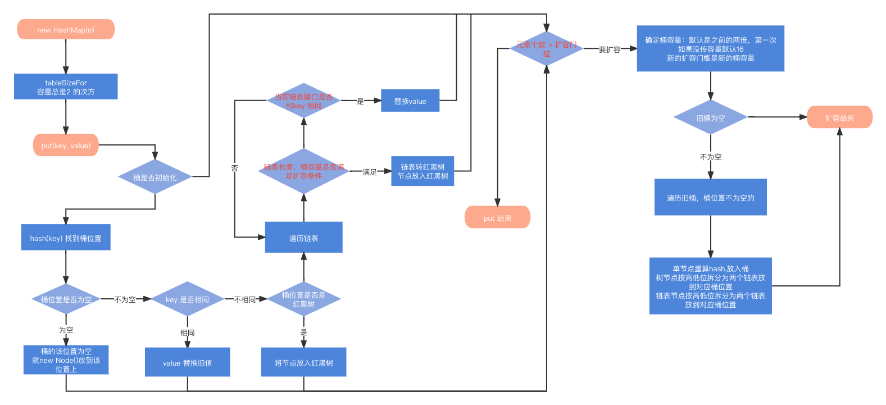
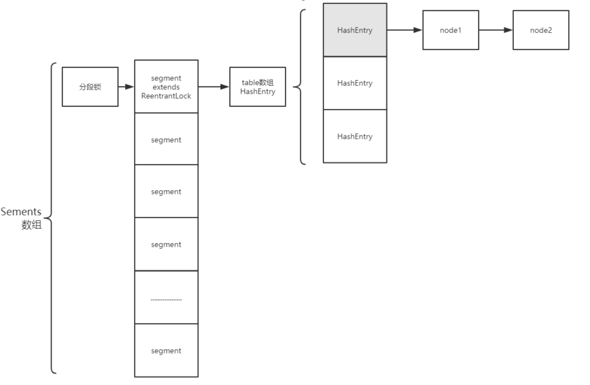
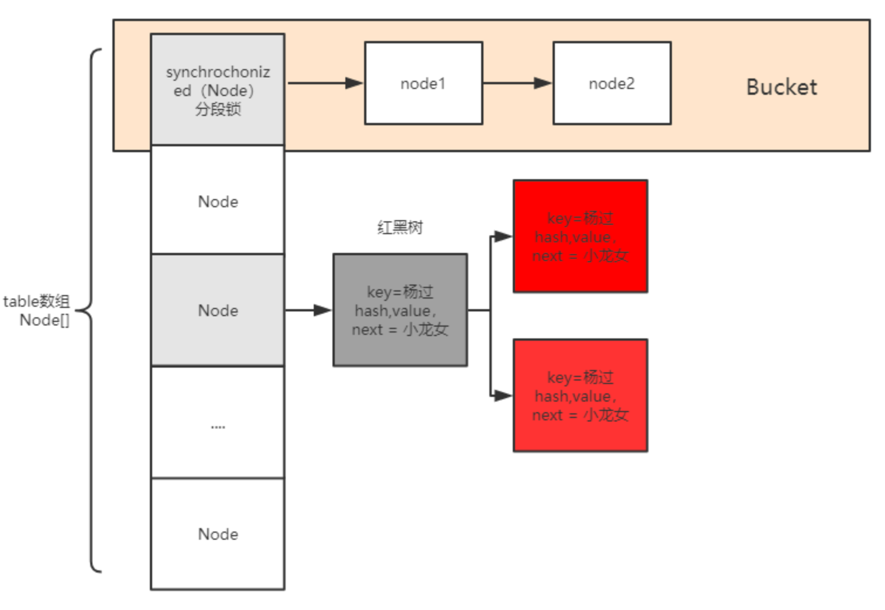
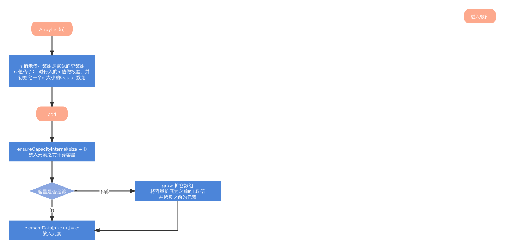
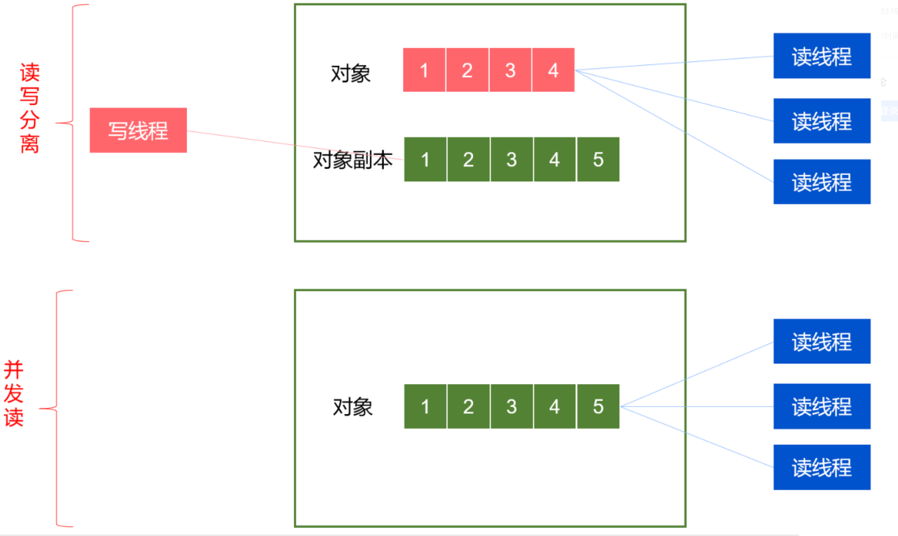
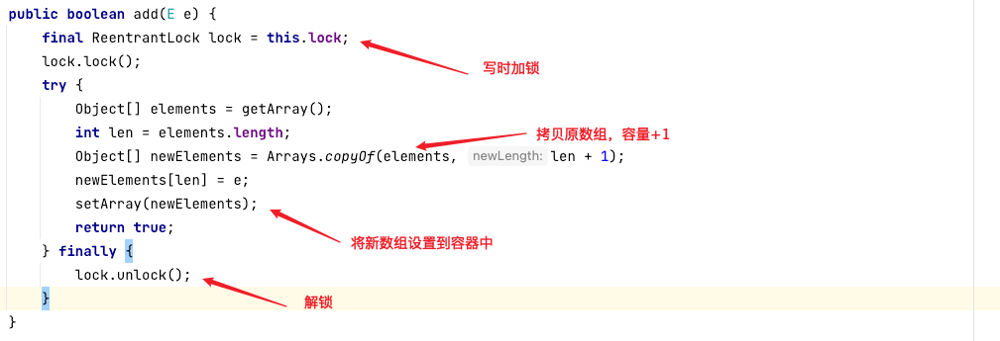

## 1. HashMap


Jdk 1.8 hashmap 使用桶 + 链表 + 红黑树的数据结构来构建


```java
// 初始默认容量 16
static final int DEFAULT_INITIAL_CAPACITY = 1 << 4; // aka 16

// 最大容量
static final int MAXIMUM_CAPACITY = 1 << 30;

// 默认负载因子
static final float DEFAULT_LOAD_FACTOR = 0.75f;

// 链表转红黑树条件
static final int TREEIFY_THRESHOLD = 8;

// 红黑树转链表条件
static final int UNTREEIFY_THRESHOLD = 6;

// 链表转红黑树桶最小容量
static final int MIN_TREEIFY_CAPACITY = 64;

// 桶
transient Node<K,V>[] table;

// 当前元素个数
transient int size;

// 扩容门槛，默认
int threshold;

// 负载因子
final float loadFactor;
```


put 流程：

第一次put 会先调用扩容方法来初始化桶，之后根据hash 函数算的当前key 该放入的桶位置, 这个位置为空直接放入，不为空就判断key 是否相同，如果是树节点就走红黑树放入节点的流程，如果是链表就遍历链表比对，没有比对上的就在链表尾节点添加，满足条件就将链表转为红黑树，最后判断当前hash map 是否该扩容，扩容会将桶容量扩大一倍将各个节点放入对应的位置。




## 2. HashSet

底层就是 HashMap<E,Object> map , map 中每个value 都是 new Object();


## 3. ConcurrentHashMap

ConcurrentHashMap的数据结构与HashMap基本类似，区别在于：

1. 内部在数据写入时加了同步机制(分段锁)保证线程安全，读操作是无锁操作；
2. 扩容时老数据的转移是并发执行的，这样扩容的效率更高。


Java7 ConcurrentHashMap基于ReentrantLock实现分段锁




Java8中 ConcurrentHashMap基于分段锁+CAS保证线程安全，分段锁基于synchronized关键字实现；
synchronized 锁的是单个Node 节点




## 4. ArrayList


```java
// 默认容量
private static final int DEFAULT_CAPACITY = 10;

// 空数组
private static final Object[] EMPTY_ELEMENTDATA = {};

// 默认容器
private static final Object[] DEFAULTCAPACITY_EMPTY_ELEMENTDATA = {};

// 容器数组
transient Object[] elementData; 

// 元素个数
private int size;
```


add 流程：




## 5. LinkedList

LinkedList 基于双向链表实现


```java
// 元素个数
transient int size = 0;

// 头指针
transient Node<E> first;

// 尾指针
transient Node<E> last;
```


LinkedList 保存了链表的头尾节点，所以对头尾的增删速度较快，而操作链表中间位置的元素需要遍历。

对比ArrayList： LinkedList 不需要连续的内存空间，可以利用碎片化内存，所以遍历速度慢于ArrayList。

随机读取速度慢于ArrayList。

顺序插入两者差不多。

随机增删两者都有缺点，ArrayList需要挪动数组，链表需要遍历找到位置。


## 6. CopyOnWriteArrayList


核心思想：读写分离，空间换时间，避免为保证并发安全导致的激烈的锁竞争。


1. CopyOnWrite适用于读多写少的情况，最大程度的提高读的效率；
2. CopyOnWrite是最终一致性，在写的过程中，原有的读的数据是不会发生更新的，只有新的读才能读到最新数据；
3. 如何使其他线程能够及时读到新的数据，需要使用volatile变量；
4. 写的时候不能并发写，需要对写操作进行加锁；








