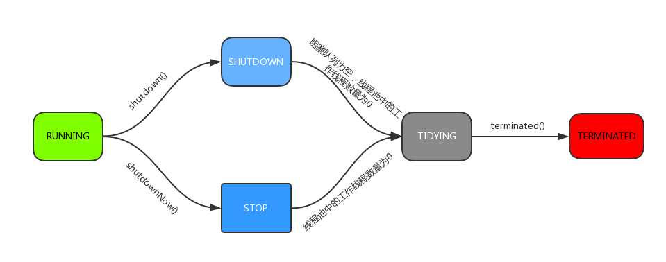
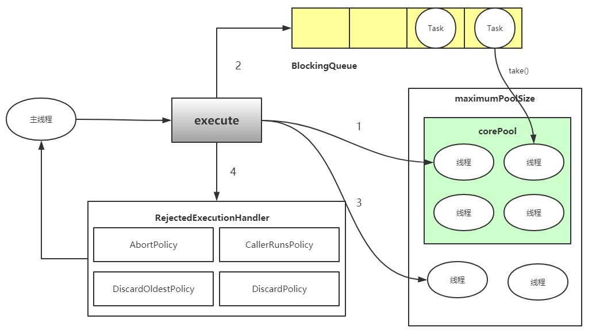
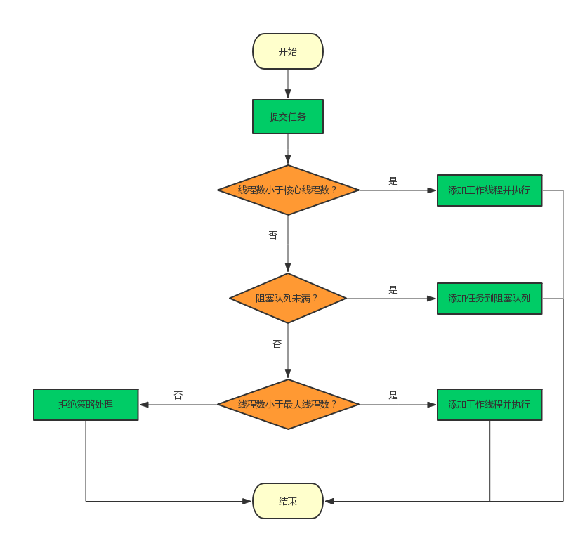
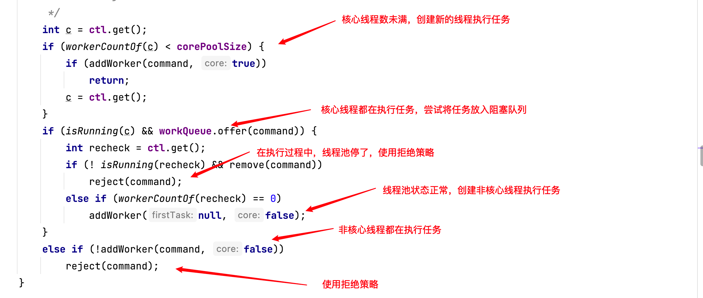
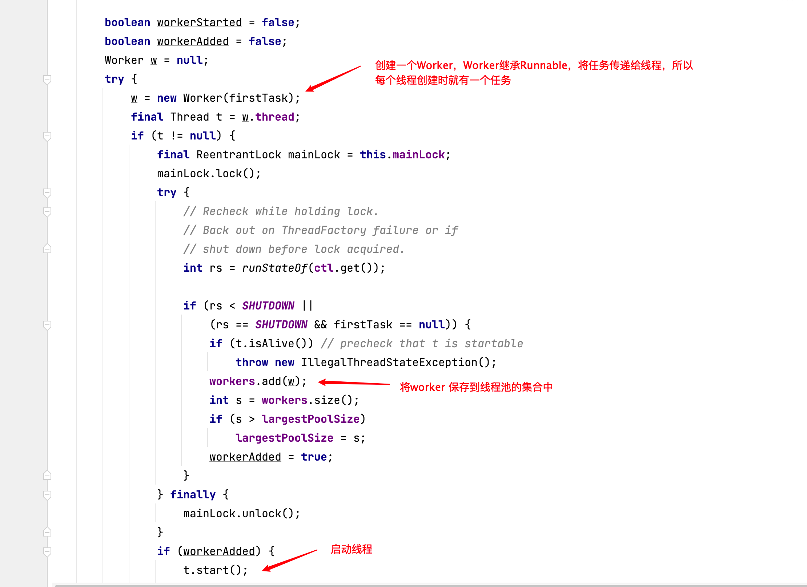
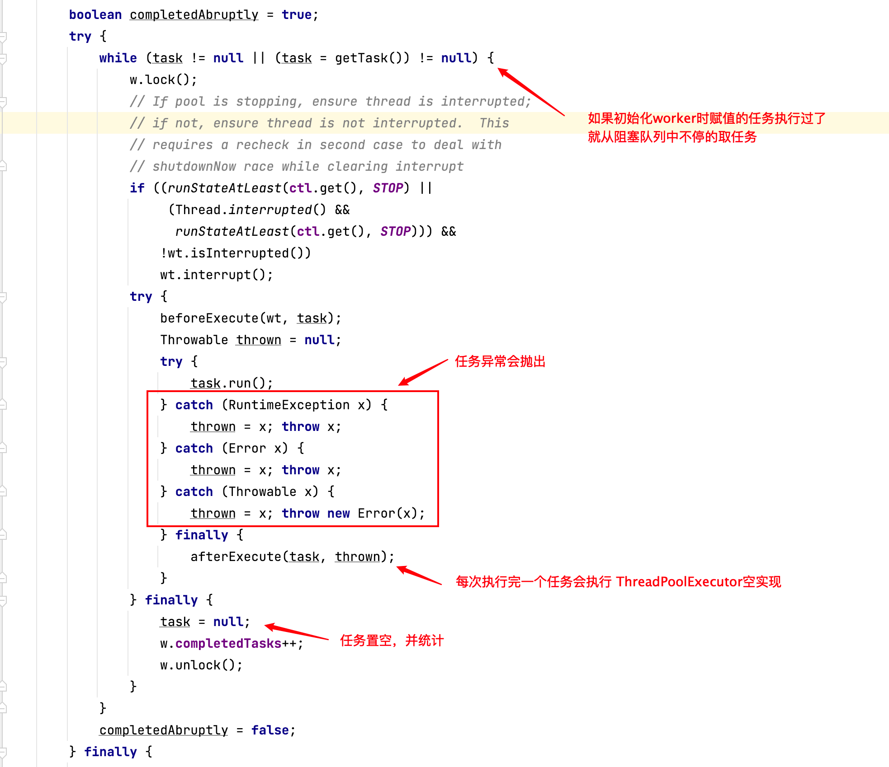

概念：

“线程池”，顾名思义就是一个线程缓存，线程是稀缺资源，如果被无限制的创建，不仅会消耗系统资源，还会降低系统的稳定性，因此Java中提供线程池对线程进行统一分配、调优和监控。

**WEB 应用中当请求数量非常多，但每个线程执行的时间很短，这样就会频繁的创建和销毁线程，如此一来会大大降低系统的效率。可能出现服务器在为每个请求创建新线程和销毁线程上花费的时间和消耗的系统资源要比处理实际的用户请求的时间和资源更多。线程池就能很好的解决这类问题**


线程池适用的地方：

- 单个任务处理时间比较短
- 需要处理的任务数量很大


线程池优势

- 重用存在的线程，减少线程创建，消亡的开销，提高性能
- 提高响应速度。当任务到达时，任务可以不需要的等到线程创建就能立即执行。
- 提高线程的可管理性。线程是稀缺资源，如果无限制的创建，不仅会消耗系统资源，还会降低系统的稳定性，使用线程池可以进行统一的分配，调优和监控。


ExecutorService接口定义了线程池的具体行为：

* **execute**（Runnable command）：履行Ruannable类型的任务,

* **submit**（task）：可用来提交Callable或Runnable任务，并返回代表此任务的Future对象

* **shutdown**（）：在完成已提交的任务后封闭办事，不再接管新任务,

* **shutdownNow**（）：停止所有正在履行的任务并封闭办事。

* **isTerminated**（）：测试是否所有任务都履行完毕了。

* **isShutdown**（）：测试是否该ExecutorService已被关闭。

  


ThreadPoolExecutor 属性和其相关方法

```java
/*
ctl 是对线程池的运行状态和线程池中有效线程的数量进行控制的一个字段， 它包含两部分的信息: 线程池的运行状态 (runState) 和线程池内有效线程的数量 (workerCount)，这里可以看到，使用了Integer类型来保存，高3位保存runState，低29位保存workerCount。
*/
private final AtomicInteger ctl = new AtomicInteger(ctlOf(RUNNING, 0));
/*
COUNT_BITS 就是29，CAPACITY就是1左移29位减1（29个1），这个常量表示workerCount的上限值，大约是5亿。
*/
private static final int COUNT_BITS = Integer.SIZE - 3;
private static final int CAPACITY   = (1 << COUNT_BITS) - 1;

// 高3位： 111 
// 线程池处在RUNNING状态时，能够接收新任务，以及对已添加的任务进行处理。 
private static final int RUNNING    = -1 << COUNT_BITS;
// 高3位： 000
// 线程池处在SHUTDOWN状态时，不接收新任务，但能处理已添加的任务。 
private static final int SHUTDOWN   =  0 << COUNT_BITS;
// 高3位： 001
// 线程池处在STOP状态时，不接收新任务，不处理已添加的任务，并且会中断正在处理的任务。 
private static final int STOP       =  1 << COUNT_BITS;
// 高3位： 010
/*当所有的任务已终止，ctl记录的”任务数量”为0，线程池会变为TIDYING状态。当线程池变为TIDYING状态时，会执行钩子函数terminated()。terminated()在ThreadPoolExecutor类中是空的，若用户想在线程池变为TIDYING时，进行相应的处理；可以通过重载terminated()函数来实现。 
*/
private static final int TIDYING    =  2 << COUNT_BITS;
// 高3位： 011
// 线程池彻底终止，就变成TERMINATED状态。 
private static final int TERMINATED =  3 << COUNT_BITS;

// 获取运行状态
private static int runStateOf(int c)     { return c & ~CAPACITY; }
// 获取活动线程数
private static int workerCountOf(int c)  { return c & CAPACITY; }
// 获取运行状态和活动线程的值
private static int ctlOf(int rs, int wc) { return rs | wc; }
```


线程池状态流转：




### 1. ThreadPoolExecutor 默认线程池

#### 1.1 核心参数

```java
public ThreadPoolExecutor(int corePoolSize,
                          int maximumPoolSize,
                          long keepAliveTime,
                          TimeUnit unit,
                          BlockingQueue<Runnable> workQueue,
                          ThreadFactory threadFactory,
                          RejectedExecutionHandler handler) 
```

* **corePoolSize**: 线程池中的核心线程数，当提交一个任务时，线程池创建一个新线程执行任务，直到当前线程数等于corePoolSize；如果当前线程数为corePoolSize，继续提交的任务被保存到阻塞队列中，等待被执行；如果执行了线程池的prestartAllCoreThreads()方法，线程池会提前创建并启动所有核心线程
* **maximumPoolSize**: 线程池中允许的最大线程数。如果当前阻塞队列满了，且继续提交任务，则创建新的线程执行任务，前提是当前线程数小于maximumPoolSize；
* **keepAliveTime**: 线程池维护线程所允许的空闲时间。当线程池中的线程数量大于corePoolSize的时候，如果这时没有新的任务提交，核心线程外的线程不会立即销毁，而是会等待，直到等待的时间超过了keepAliveTime；
* **unit**: keepAliveTime的单位；
* **workQueue**: 用来保存等待被执行的任务的阻塞队列，且任务必须实现Runable接口
  * ArrayBlockingQueue：基于数组结构的有界阻塞队列，按FIFO排序任务；
  * LinkedBlockingQuene：基于链表结构的阻塞队列，按FIFO排序任务，吞吐量通常要高于ArrayBlockingQuene；
  * SynchronousQuene：一个不存储元素的阻塞队列，每个插入操作必须等到另一个线程调用移除操作，否则插入操作一直处于阻塞状态，吞吐量通常要高于LinkedBlockingQuene；
  * priorityBlockingQuene：具有优先级的无界阻塞队列；
* **threadFactory**: 它是ThreadFactory类型的变量，用来创建新线程。默认使用Executors.defaultThreadFactory() 来创建线程。使用默认的ThreadFactory来创建线程时，会使新创建的线程具有相同的NORM_PRIORITY优先级并且是非守护线程，同时也设置了线程的名称。
* **handler**: 线程池的饱和策略，当阻塞队列满了，且没有空闲的工作线程，如果继续提交任务，必须采取一种策略处理该任务，线程池提供了4种策略：
  - AbortPolicy：直接抛出异常，默认策略；
  - CallerRunsPolicy：用调用者所在的线程来执行任务；
  - DiscardOldestPolicy：丢弃阻塞队列中靠最前的任务，并执行当前任务；
  - DiscardPolicy：直接丢弃任务；
* 


#### 1.2 常用方法


```java
// 提交任务无返回值
public void execute();
// 任务执行完成后有返回值
public Future<?> submit();

// 线程池已执行与未执行的任务总数
public long getTaskCount() 
// 已完成的任务数
public long getCompletedTaskCount() 
// 线程池当前的线程数
public int getPoolSize() 
// 线程池中正在执行任务的线程数量
public int getActiveCount() 
```


### 1.3 线程池执行原理 & 流程






总体流程体现：java.util.concurrent.ThreadPoolExecutor#execute




创建线程体现：java.util.concurrent.ThreadPoolExecutor#addWorker




执行任务体现： java.util.concurrent.ThreadPoolExecutor#runWorker




### 2. ScheduledThreadPoolExecutor 定时线程池


